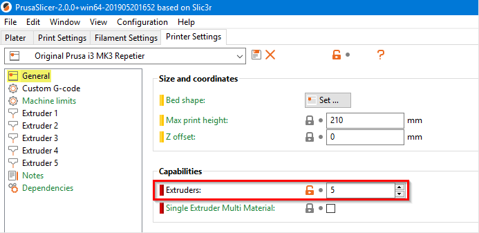

# PrusaSlicer advanced filament change

## Overview
This Python script allows a 'real' filament change in PrusaSlicer. By default the PrusaSlicer insert a M600 command for change the color of filament. In this case of color change the properties of the different filaments aren't considered.

With this script you can use your favorite filament profiles for generating multi color objects. The settings for the different materials like the filament diameter, flow and temperature are considered in the slicing process.

## Installation

1. To use this Python script you need the **[latest release of Python](https://www.python.org/downloads/)**.

2. Download the file **ChangeMaterial.py** and save it to your favorite folder.

## Configuration

### Step 1: Printer settings

First you have to set the count of extruders in **Printer Settings** > **General** > **Capabilities**. The count of extruders specifies the number of different filaments you want to use for multi color print.

### Step 2: Print settings

In the print settings tab you have to include the Python script. Go to **Print Settings** > **Output options** > **Post-processing scripts** and add the absolute path to the python.exe followed by absolute path to the Python script.

*For example:*

*C:\Users\USERNAME\AppData\Local\Programs\Python\Python37-32\python.exe D:\ChangeMaterial.py*

In case you won't print a multi color object you don't have to clear this field. It will work fine. It's recommend to save step 1 and 2 in new profiles.

### Step 3: Slicing multi color objects

First import your STL file. This script works with multi part STL files. Also you can use the feature of *modifiers*. To assign different filaments right click on the icon and *'Split to parts'* or *'Add part/modifier'*.

Now you can choose an extruder for every single part **(2)**. These are the assignments of different filament profiles from above **(1)**. Choose your favorite filament for every part. If you have chosen all the colors hit slice. In background the script modifies the gcode file and generate a new one with *'multi_color'* in its filename.

That's it, now you can print this file.

### Step 4: Customizing the script (optional)

By default the script works with print server like Repetier Server or OctoPrint. By modifying the script you can also print from SD card.

Please check the comments in the script for more information.

## Feedback

This is one of my first projects in Python. It would be very nice if you write comments and report any bugs or questions. Thanks a lot!